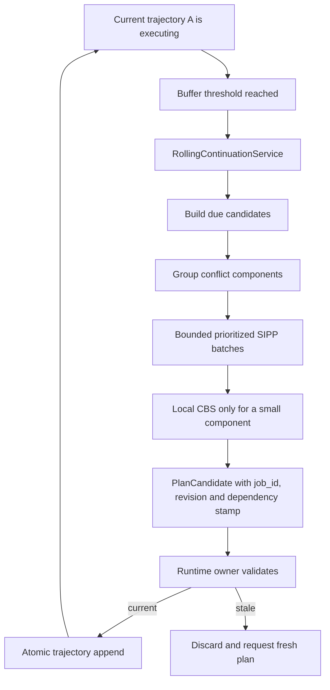
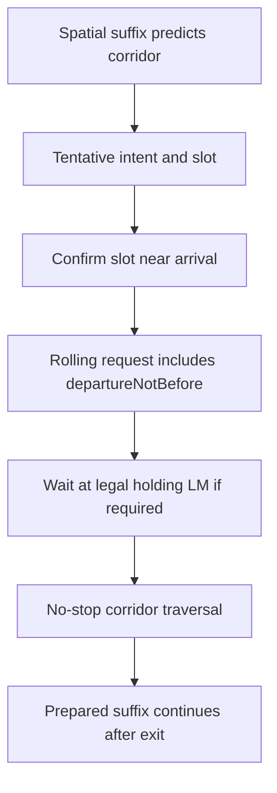

# Rolling refill

## Зачем изменён pipeline

Старая схема начинала готовить следующий участок примерно в один момент для
всего флота и обычно обслуживала только первого кандидата. При 50 роботах это
создавало волну запросов. Робот, которому не хватило очередного planning turn,
доезжал до границы chunk, переходил в `rolling continuation pending` и сам
становился неподвижным препятствием. После этого следующие задачи MAPF уже
решали более сложную дорожную ситуацию.

`WAITING: next route segment` теперь считается отказом runtime pipeline. Это не
штатный способ регулировать трафик.

## Два разных горизонта

Fleet Manager различает:

- hard reservation horizon — короткий интервал точных временных reservations;
- prepared route buffer — уже рассчитанная траектория, которую робот сможет
  продолжать выполнять без нового ответа planner;
- refill, urgent, critical и emergency thresholds — моменты повышения
  приоритета подготовки;
- maximum prepared buffer — верхняя граница мягкой будущей траектории.

Единое значение `FleetRobot.route_buffer_seconds` вычисляется как время
последнего sample траектории минус текущий `route_clock`. Другие модули не
повторяют эту формулу.

Default-порядок порогов проверяется strict configuration:

```text
emergency < critical < urgent < refill < target <= maximum
```

Текущие realtime defaults после benchmark: hard reservation `15 s`, target
buffer `75 s`, refill `55 s`, urgent `30 s`, critical `15 s`, emergency `5 s`
и maximum prepared buffer `150 s`. Hard reservation не заменяет prepared
buffer: первый защищает ближайшие конфликтующие ресурсы, второй даёт planner
время подготовить следующий участок без остановки робота.

## Состояния и приоритеты

`RollingBufferPolicy` классифицирует активный маршрут как `HEALTHY`, `NORMAL`,
`URGENT`, `CRITICAL` или `EMPTY`. Планировщик прежде всего обслуживает ближайшее
исчерпание буфера. При одинаковой срочности учитываются deadline, время первой
готовности, последний planning turn и стабильное имя робота.

Planning priority имеет следующий порядок:

```text
SAFETY_REPLAN
ROLLING_EMERGENCY
ROLLING_CRITICAL
DEADLOCK_RECOVERY
ROLLING_URGENT
ROLLING_NORMAL
ORDER_DISPATCH
BACKGROUND_OPTIMIZATION
```

После исчезновения critical pressure обычный dispatch снова получает planning
turn. NORMAL refill и dispatch используют ограниченное чередование.
Пока существует CRITICAL/EMPTY кандидат, admission не запускает ordinary
dispatch или deadlock recovery перед ним. Само сравнение priority в scheduler
недостаточно, если важная задача ещё не была submitted.

## Почему нет синхронной волны

Для NORMAL refill используется стабильный сдвиг threshold, вычисленный из
CRC32 robot ID. Он распределяет одинаково стартовавших роботов по небольшому
временному окну. Для URGENT, CRITICAL и EMPTY этот сдвиг не применяется.

Кандидаты группируются по будущему spatial suffix. Связь существует при общем
node, edge, встречном edge, traffic resource либо известной зависимости от
blocker. Один prioritized-SIPP batch ограничен настройкой
`rolling_normal_batch_size`. Независимые компоненты можно решить одним быстрым
SIPP вызовом, но они не получают общий CBS fallback. CBS разрешён только для
одного небольшого связанного компонента в пределах `local_cbs_max_robots`.
CRITICAL/EMPTY refill отправляется отдельно: его latency не зависит от
неуспеха несвязанного NORMAL участника общей all-or-nothing SIPP пачки. При
этом snapshot по-прежнему содержит маршруты и reservations остальных роботов,
поэтому изоляция job не означает изоляцию от collision validation.
Exponential retry backoff для CRITICAL/EMPTY ограничен половиной оставшегося
времени до emergency threshold. После повторного `no_sipp_path` exhausted
continuation один раз меняет spatial corridor, если существует безопасный
alternate route, вместо бесконечного повторения того же suffix.

Обычная первая попытка dispatch одного робота также не запускает CBS: CBS не
может передвинуть внешнего владельца immutable reservation. Fallback
разрешается после повторных отказов, когда dispatcher сформировал маленькую
реально связанную recovery group.

## Индивидуальное время начала

Каждый rolling request содержит абсолютное simulation time:

```json
{
  "name": "robot_042",
  "reservationStartTimeSec": 153.4
}
```

На границе MAPF это значение один раз преобразуется в относительный
`start_not_before_tick`. Поэтому sibling routes внутри одного SIPP batch
резервируют друг друга даже при разных временах окончания текущих chunks.

`reservationStartTimeSec` задаёт абсолютный момент handoff только внутри SIPP:
он запрещает занимать ресурсы раньше окончания текущего chunk. Публичный
trajectory builder возвращает время относительно handoff конкретного робота.
Поэтому `rollingStartOffsetSec` нельзя второй раз вырезать из готовой
траектории. Такое двойное применение offset удаляло начало реального движения:
`chunkGoal` указывал на следующий LM, хотя исполняемая траектория заканчивалась
раньше. Append сдвигает всю относительную continuation к времени конца текущего
chunk; `route_clock` при этом никогда не сбрасывается.

## Spatial route reuse

Обычный refill использует `order.spatial_route_nodes` и
`order.spatial_route_cursor`. Новый spatial A* нужен только после инвалидного
suffix, blocker/detour, изменения карты либо recovery. Счётчики
`spatial_route_reused` и `spatial_route_replanned` показывают фактическое
поведение.

## Commit принадлежит runtime owner

Worker получает immutable `PlanningSnapshot` и публикует `PlanCandidate`. Он не
изменяет robots, orders, reservations или corridor leases. Runtime находит
transaction по `candidate.job_id`, проверяет revision и corridor gate, затем
атомарно применяет результат. Старый manager-level active slot оставлен только
как временный compatibility view; association результата и transaction больше
от него не зависит.

Общая revision всё ещё является быстрым строгим условием. Если она изменилась,
rolling job дополнительно проверяет immutable `PlanningDependencyStamp`:
route revisions участников, map/graph identity, blockers и владельцев traffic
resources. Это позволяет не выбрасывать готовый suffix из-за добавления
несвязанного заказа. Изменение маршрута участника, blocker, corridor/zone owner
или карты по-прежнему делает candidate stale. Dispatch, safety и recovery
результаты остаются на строгой global revision. Перед append rolling trajectory
повторно проходит live continuous-collision validation, а commit дважды
проверяет stamp и сохраняет rollback checkpoint.

Checkpoint содержит только robots/orders — участников текущего job. Общие
reservations, corridor/zone state и recovery state сохраняются отдельно. Это
оставляет commit атомарным, но не копирует trajectories всего флота перед
каждым применением результата.

`RollingAppendResult` объясняет конкретный отказ append. Обычный неуспешный
append не считается committed. `pending_route` остаётся только аварийным
handoff, когда route buffer уже ниже emergency threshold.



## Traffic zones и controlled corridors

Traffic-zone admission и corridor scheduling остаются отдельными причинами
ожидания. Робот может ждать zone/corridor только на legal external LM, имея
подготовленную траекторию. Это не считается route-buffer underrun.

Для controlled corridor это состояние подтверждается не текстом статуса, а
назначением holding LM, связанным с тем же `order_id`, `route_revision` и
фактическим endpoint текущего chunk. Commit подходного маршрута переносит
назначение на новую revision. Поэтому старый/stale marker не может скрыть
настоящий нулевой route buffer. В snapshot и benchmark эти случаи вынесены в
`controlledCorridorWaitingCount`/`controlledCorridorWaitEvents`, отдельно от
`rollingBufferUnderruns` и `nextSegmentWaitCount`.

После фактического достижения holding LM runtime сохраняет отдельный
revision-bound active-hold token. Calendar может заменить approach intent или
passage projection, пока робот ждёт следующий slot, но это не превращает уже
проверенный legal hold в rolling underrun. Любой новый route commit удаляет
token, поэтому старый текст статуса не может скрыть исчерпание другой revision.



Gate-pending кандидат получает `retry_at`, поэтому он не занимает каждый
planning turn и не мешает unrelated refill. Перед commit slot проверяется ещё
раз. Изменившийся slot приводит к safe retry, а не к небезопасному append.
Обычный gate retry ограничен двумя секундами, но при `CRITICAL/EMPTY` он
сокращается до physics step или половины запаса до emergency threshold. Старый
normal retry при этом заменяется более ранним: ожидающий сигнал робот не может
исчерпать короткий chunk только из-за debounce календаря.
Геометрия ближайшего authored passage кэшируется на время одной route revision.
На physics tick обновляются только живые поля `eta`, `at_staging` и
`passed_staging`; полный scan повторяется после смены маршрута или выхода из
passage. Это сохраняет admission semantics и не заставляет 100 роботов
повторно обходить полные trajectories на каждом tick.

Calendar решает независимые наборы corridor resources отдельными компонентами.
Это не меняет расписание внутри связанного узкого ресурса, но не заставляет
несвязанные коридоры участвовать в одном комбинаторном поиске. Проверка
downstream blockers использует spatial buckets текущих и terminal poses, после
чего обязательно выполняет прежнюю exact footprint-проверку. Индекс является
только broad phase и не может разрешить небезопасный вход.

Nominal trajectory future intent и его downstream probe строятся один раз на
неизменную сигнатуру route. На каждом calendar refresh меняются только live
clock и blocker facts. Карта направлений resource windows также строится один
раз на calendar build и передаётся в прежнее predecessor-сравнение. Эти кэши не
являются authority: slot, footprint и revision всё равно проверяются заново
перед commit.

Если critical refill повторно не строится из-за конкретного уже записанного
waiting blocker, runtime до окончания chunk запускает существующую bounded
corridor evacuation для этой пары. Внутри emergency buffer достаточно первого
отказа: ждать второй попытки уже небезопасно по времени. Он не угадывает blocker
по близости и не запускает global CBS. Так освобождение начинается до нулевого
buffer, а не после превращения робота в новое неподвижное препятствие.

## Диагностика и benchmark

Snapshot веб-симулятора содержит компактные поля `routeBufferSec`,
`rollingRefillStatus`, `rollingRefillJobId`, `rollingAppendStatus` и агрегат
`rollingRefill`. Полные trajectories из-за этой диагностики не передаются.

Headless runner запускается без браузера:

```bash
python3 -m operator_app.core.fleet_benchmark_runner --scenario open-50
python3 -m operator_app.core.fleet_benchmark_runner --scenario open-100
python3 -m operator_app.core.fleet_benchmark_runner --scenario zones-100
python3 -m operator_app.core.fleet_benchmark_runner --scenario corridors-100
```

Длительность эксперимента не меняет поведение planner: planning horizon имеет
отдельный default `75 s` и при необходимости задаётся через
`--planning-horizon-sec`. Поэтому короткий smoke test и длинный longevity run
сравнивают одну конфигурацию, а не маршруты разной длины.

Он измеряет throughput, collisions, deadlock cycles, underruns, next-segment
waits, queue/solver percentiles, buffer percentiles, stale/cancelled jobs, CBS
fallback, append failures, pending handoffs, peak queue и RSS growth.
100-robot zone/corridor scenarios используют
`smart_kiva_large_w_mode.smap`: на карте 576 LM и 32 authored controlled
corridors. Старая operator default map имеет лишь 61 collision-safe spawn и
поэтому не подходит для честного 100-robot benchmark.

Profiler включается только после warm-up:

```bash
python3 -m operator_app.core.fleet_benchmark_runner \
  --scenario open-50 --duration-sec 120 \
  --profile-path /tmp/fleet_manager_open50.pstats
```

Runtime collision scan сначала использует безопасный circumscribed-circle
broad phase. Он только отбрасывает физически недостижимые пары; ближайшие пары
всегда проходят прежнюю exact oriented/swept-footprint проверку. Full-edge
preflight запускается реже и имеет стабильную CRC32-фазу для каждого робота,
а immediate exact check выполняется на каждом physics step.
Список дальней lookahead-проверки дополнительно сужается для каждой временной
точки по максимальному физически достижимому сближению. Поэтому робот, который
может встретиться через пять секунд, проверяется до входа в passage, но его
trajectory не интерполируется на всех более ранних samples.

Неуспешный поиск deadlock evacuation запоминается на короткий cooldown по
стабильной сигнатуре LM/order/goal. Изменившаяся геометрия проверяется сразу,
а неизменный дорогой поиск graph escape не повторяется на каждом priority
lease.
Проверка reverse retreat сначала отбрасывает текущие тела вне bounding box
пути, а затем сохраняет прежний плотный exact footprint sweep для оставшихся
кандидатов.

Planning worker принимает решение «очередь пуста, поток завершает владение» и
очищает ссылку на поток под одним `Condition`. Поэтому submit не может увидеть
ещё живой worker, положить job в очередь и оставить её без нового worker в
окне завершения.

Архитектурный invariant для normal operation:

```text
MOVING robot + buffer below critical + no QUEUED/RUNNING refill
    => rolling_buffer_unprotected

zero buffer before final goal outside a revision-bound controlled holding LM
    => rolling_buffer_underrun
```
