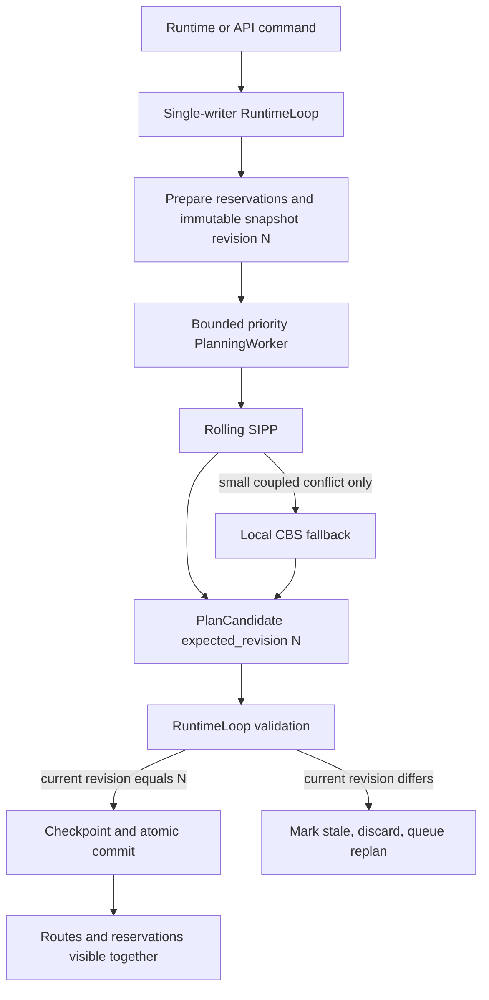

# State ownership and planning

## Главный инвариант

Только `RuntimeLoop` применяет изменения к live-состоянию Fleet Manager.
HTTP/gRPC/operator callbacks передают команду owner-thread через
`RuntimeLoop.execute()`. Planning worker вычисляет только `PlanCandidate` и не
получает `FleetManagerCore`, runtime callbacks, ROS2 nodes, sockets или другие
mutable runtime objects.

До запуска runtime loop команды могут выполняться синхронно. Это нужно для
инициализации и pure-Python тестов. После запуска приложения все публичные
команды изменения состояния проходят через owner-thread.

## Контейнеры состояния

`FleetManagerCore` в `manager.py` является composition root и явно создаёт
четыре контейнера:

- `FleetState` — robots, task store, operator events, world obstacles и общий
  `RevisionClock`;
- `TrafficState` — temporal reservations, stationary blockers, traffic-zone
  state, controlled-corridor schedule/leases и traffic metrics;
- `PlanningState` — активная planning job, runtime replans, rolling
  continuation latches и runtime-owned lifecycle planning jobs;
- `RecoveryState` — wait cycles, recovery attempts, quarantine и cooldowns.

Контейнеры собраны в одном модуле `fleet_manager/manager/state.py`.
Там же явно создаются `FleetMapfPlanner`, robot gateway,
`PlanningSnapshotFactory`, `PlanningSolverService`, bounded
`PlanningWorker`, `PlanCommitService` и три task service. Immutable
snapshot/job/result модели находятся в
`fleet_manager/manager/planning.py`, включая границы solver/commit. Bounded
worker находится в `fleet_manager/manager/scheduler.py`. Отдельного
package с одним state-классом на файл нет.

Сохраняемые mixin-методы пока используют переходные properties (`robots`,
`_controlled_corridor_leases`, `_runtime_replans` и другие). Property возвращает
тот же объект из контейнера и не создаёт второй словарь или второй источник
истины. Новый код получает контейнеры через constructor injection.

## Immutable PlanningSnapshot

Snapshot создаётся только перед реальной planning job. Он содержит компактные
frozen-модели robots, committed routes, reservations, traffic resources,
blockers, map/graph revisions и подготовленный solver payload. Mutable mappings
и lists преобразуются в `FrozenMapping` и tuples.

Snapshot не является `deepcopy(FleetManagerCore)`. В него не попадают locks,
threads, callbacks, transport clients или manager services. Solver получает
свежую mutable копию только своего payload через `to_dict()`.

## Planning revision

`RevisionClock` монотонно растёт при изменении planning input:

- добавление, удаление, stop, fault или существенное обновление робота;
- добавление, cancel, pause, resume или очистка заказа;
- commit нового маршрута;
- изменение obstacles или planning params;
- изменение stationary blockers, traffic-zone leases, corridor leases или
  corridor calendar;
- reset planning runtime и смена режима/скорости симуляции, влияющая на
  planning horizon.

Оставшиеся mixins дополнительно проверяются компактным deterministic fingerprint в
начале и конце runtime tick. Предсказуемое продвижение `route_clock` по уже
committed trajectory не увеличивает revision: solver уже получил эту trajectory
и её `route_revision`. Аналогично внутренний переход активного заказа между
`EXECUTING` и `PLANNING` при rolling handoff не делает собственное продолжение
устаревшим. Внешнее изменение route, owner, lease или graph-stable robot state
revision увеличивает.

## Путь planning job

Lifecycle job проходит состояния:

`QUEUED → RUNNING → COMPLETED → COMMITTED`

Терминальные альтернативы: `CANCELLED`, `DEADLINE_EXCEEDED`, `STALE`,
`FAILED`. Immutable `PlanningJob` описывает запрос, а mutable
`PlanningJobRecord` хранит lifecycle. Его `transition_to()` проверяет
разрешённые переходы. Worker публикует immutable lifecycle events; record в
`PlanningState` меняет только runtime owner при сборе событий.

## Revisioned и atomic commit

Каждый `PlanCandidate` содержит `expected_revision`. Runtime повторно проверяет
revision после safety validation и непосредственно перед checkpoint. При
совпадении применяются существующие route revision, route clock, controlled
corridor и continuous footprint checks.

Commit сохраняет небольшой rollback image только данных, которые может менять
route transaction. Исключение восстанавливает robots, orders, reservations,
traffic/recovery/planning state, corridor calendar и revision. Частичный маршрут
или половина reservation set не остаются видимыми. Stale candidate ничего не
применяет, не считается ошибкой solver-а и создаёт нормальный retry/replan state.

## Priority, bounded queue и coalescing

Scheduler использует один solver thread и ограниченную очередь. Порядок:

1. `SAFETY_REPLAN`;
2. `DEADLOCK_RECOVERY`;
3. `ROLLING_CONTINUATION`;
4. `ORDER_DISPATCH`;
5. `BACKGROUND_OPTIMIZATION`.

Внутри priority используется FIFO submission sequence. При заполнении очереди
более приоритетная job может вытеснить худшую queued job; обычный dispatch не
вытесняет safety work. Одинаковый `coalescing_key` заменяет ещё не запущенную
job. Запущенная устаревающая job получает cooperative cancellation token.
После coalescing, queued cancellation и eviction scheduler пересобирает heap из
актуального словаря queued jobs. Поэтому bounded является не только логическое
число jobs, но и физическое число heap entries. `stats()` возвращает только
числа и не раскрывает mutable collections.

Cancellation token и deadline проходят через `FleetMapfPlanner`, Rolling SIPP,
CBS, SIPP и общий A*. Проверки выполняются между robot/window/CBS-node этапами
и в search expansion loops. Cooperative cancellation имеет статус
`CANCELLED`, deadline — `DEADLINE_EXCEEDED`, неожиданное исключение — `FAILED`.
Ни один из них не маскируется как обычный solver failure. Unbounded queue
отсутствует.

## Primary и fallback result

`PlanningSolverService` сначала запускает primary payload. При обычном
неуспешном результате он может запустить подготовленный fallback payload.
`PlanCandidate.result` всегда содержит реально выбранный результат, а
`backend_used` — его backend. Диагностика обоих запусков остаётся в metadata.

При `strict_stationary_avoidance=True` успешный relaxed fallback остаётся
только диагностикой: применять маршрут, нарушающий этот safety policy, нельзя.
При обычном разрешённом fallback успешный fallback становится candidate result
и проходит тот же revision check и atomic commit. Исключение primary сохраняет
прежнюю policy: fallback не запускается, ошибка остаётся `FAILED`.

## Явные services

- `PlanningSolverService` получает только immutable `PlanningJob` и planner
  callable;
- `PlanCommitService` владеет revision check и rollback transaction;
- `OrderAdmissionService` получает `FleetState`, landmarks, clock и явные
  robot availability callbacks; он валидирует order и детерминированно выбирает
  допустимого робота;
- `RollingContinuationService` получает `FleetState`, `PlanningState`, clock,
  retry policy и узкие route callbacks; он выбирает кандидатов и строит rolling
  planning requests;
- `ReplanningService` получает `FleetState`, `PlanningState`, `RecoveryState`,
  безопасный выбор start LM, retry policy и clock; он создаёт transaction state,
  deduplicate/coupled state и записывает bounded failure retry.

Ни один из этих сервисов не получает весь `FleetManagerCore`. Spatial routing
использует общий `AStarSolver` через `_LandmarkRouteProblem`; landmark neighbors,
edge costs, congestion penalties, forbidden edges, heuristic и tie-breaking
остаются domain policy.

## Постепенная миграция mixin

Mixin-архитектура остаётся для motion, corridor admission, traffic zones,
recovery orchestration и части dispatch commit. После удаления пяти
composition-only прослоек MRO `FleetManagerCore` всё ещё содержит 53 класса с
суффиксом `Mixin`. Это намеренный постепенный переход: публичные entry points и
safety checks не переписаны big-bang способом.

`runtime_state.py` больше не создаёт контейнеры, planner, scheduler, services,
corridor graph или traffic-zone index. Он содержит compatibility properties,
revision fingerprint, runtime cleanup/reset, clock и lifecycle helpers.
Map-derived traffic state создаётся видимым методом `_create_runtime_state()` в
composition root.

Следующий модуль переносится так:

1. определить реально читаемые и изменяемые поля;
2. выбрать один state-container-владелец для каждого поля;
3. описать вход и result/event метода;
4. создать service с минимальными constructor dependencies;
5. оставить старый mixin method как тонкий adapter;
6. добавить unit test service без `FleetManagerCore`;
7. удалить adapter только после поиска usages и characterization tests.

## Инварианты, которые нельзя нарушать

- live state имеет одного writer-а — runtime loop;
- worker не применяет routes, reservations, leases или recovery transitions;
- solver input immutable и не содержит ссылок на live manager;
- candidate без совпадающей revision никогда не применяется частично;
- route и связанные reservations коммитятся одной runtime transaction;
- queue ограничена, safety priority выше dispatch, duplicate jobs coalesce;
- Rolling SIPP остаётся primary temporal planner, CBS — только локальный
  fallback связанного конфликта;
- spatial routing остаётся отдельным слоем, ROS2/Nav2 — на robot side, gRPC —
  transport boundary;
- existing collision, controlled-corridor и traffic-zone validations нельзя
  обходить ради успешного commit.
